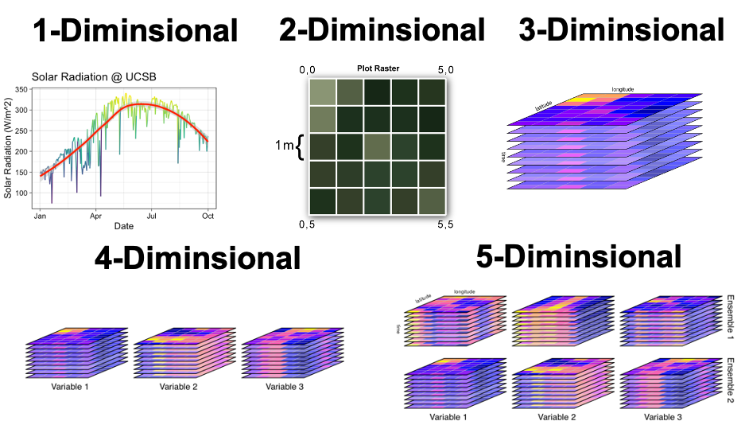
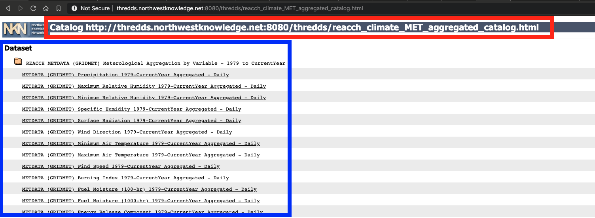
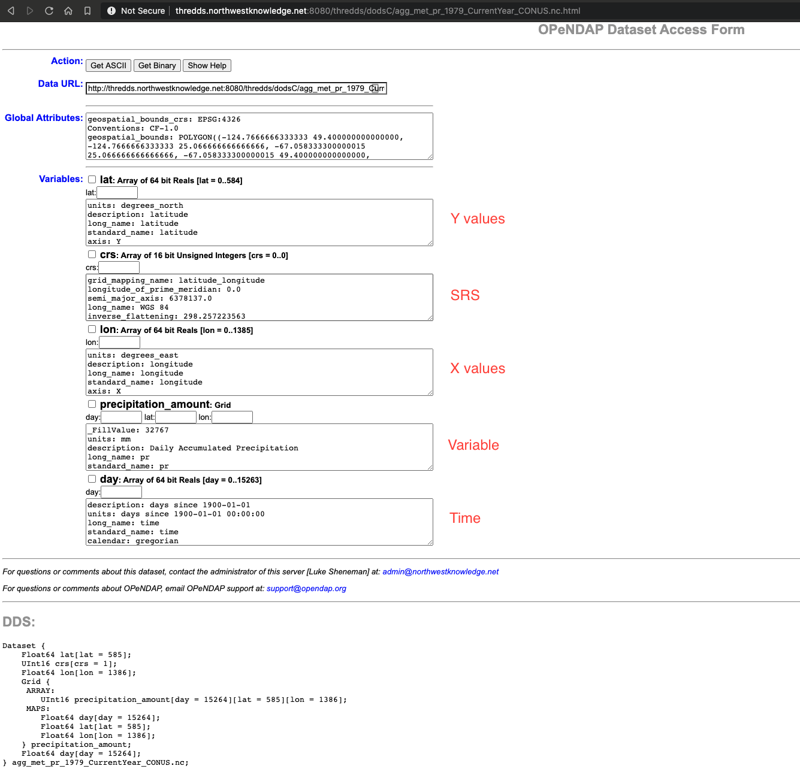
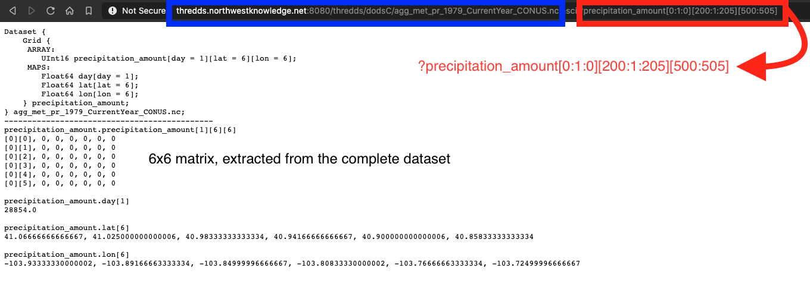
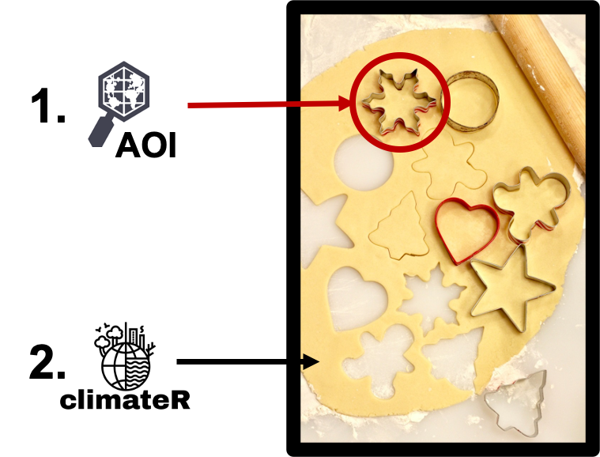
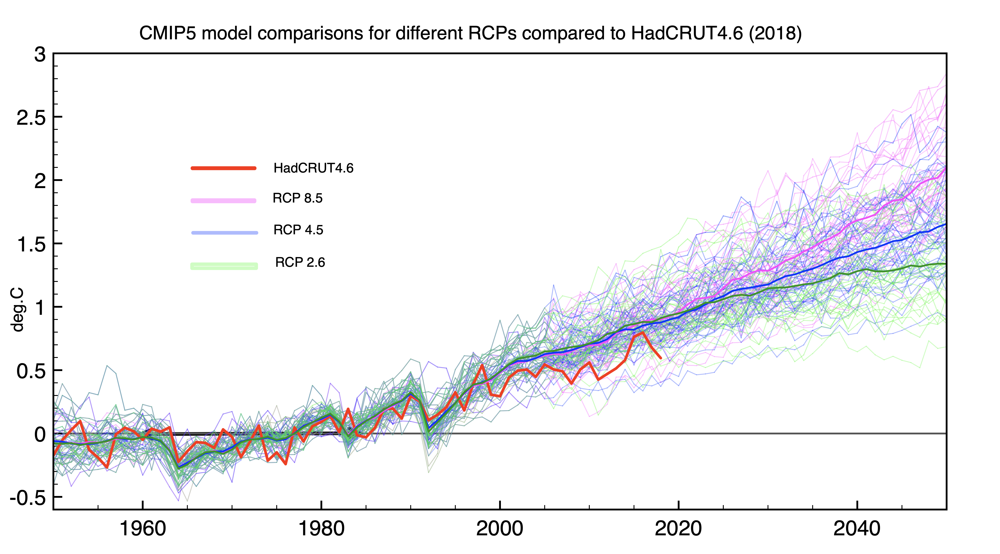
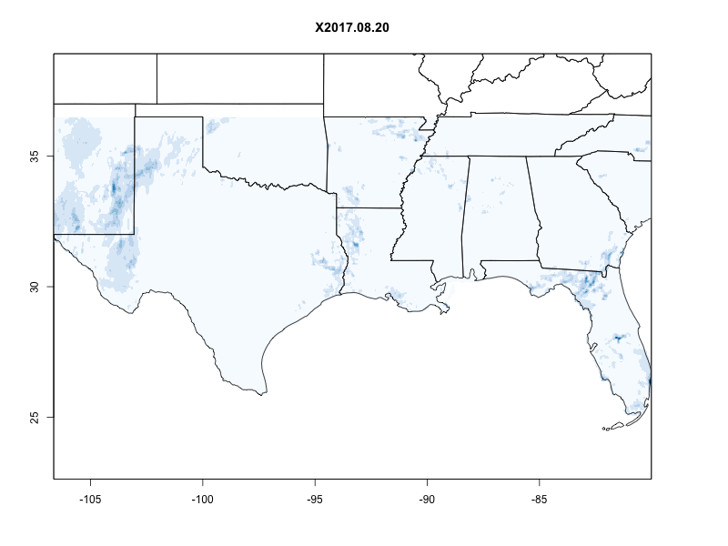
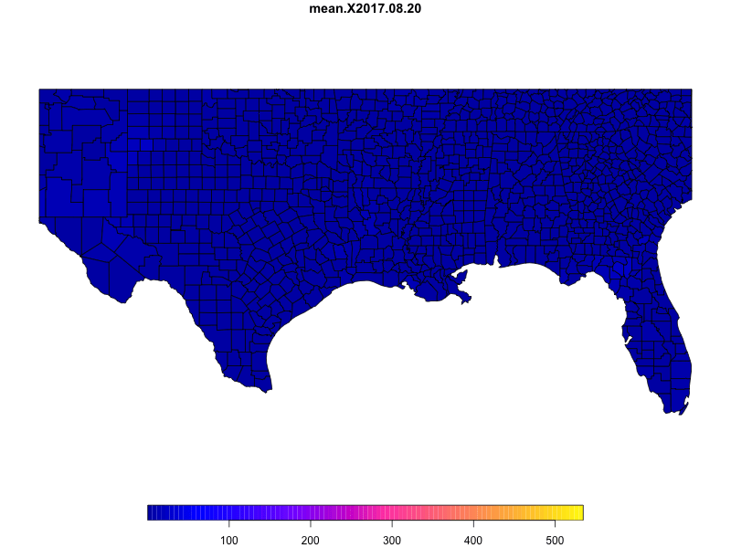

```{r setup, include=FALSE}
library(knitr)
opts_chunk$set(echo = TRUE, message = FALSE, warning = FALSE, fig.align = "center", fig.height = 5)
```

# Todays libraries

```{r}
# From CRAN
library(sf)            # dealing with vector data
library(raster)        # raster data handling
library(RNetCDF)       # OPeNDAP and NetCDF access
library(exactextractr) # Fast zonal statistics
library(rasterVis)

# From Github
#remotes::install_github("mikejohnson51/AOI")
#remotes::install_github("mikejohnson51/climateR")

library(climateR)
library(AOI)
```

---

Climate Data is a common data source used in applications across human and physical geography. For our purposes, climate data can have up to 5 dimensions

- 1D: timeseries 
- 2D: grid
- 3D: XY grid with time
- 4D: XYT cube with multiple variables (temperature, rainfall)
- 5D: XYT cube with multiple variables and models

```{r, fig.cap = "Figure 1: raster data model", echo = FALSE, out.width="50%"}

```

---

These notes covers a few topics related to climate data and its used in R including:

  1. The raster data model
  2. Finding and using climate data (the **_hard_** way)
  3. Finding and using climate data (the **_easy_** way)
  4. Some simple applications and operations that can be applied to climate data

---

# 1. The raster data model

- The raster data model is one of principle type of storing geographic data - the other being object or vector.

--

- The raster data model defines an coverage of space discritized into a set of (usually) regular grid cells

--

- A "raster" can be thought of in the same way you might think of an image you take with your phone, the picture you see on your screen, or the image you print from your computer.

--

- Whats unique about spatial rasters, is that the come with a defined coordinate reference system that describe the area of the earth (or elsewhere) it covers.

--

- There are plenty of great tutorials about how to _use_ raster data in R. Here, we want to discuss the data model as it is critical to retrieving climate data from remote sources. 

---

## The five components:

A raster is defined by five key pieces of information:

.pull-left[

  - Values
  - An extent 
  - The resolution (Xres, Yres)
  - The number of cells in the X an Y directions
  - A spatial reference system
]

.pull-right[

```{r, fig.cap = "Figure 2: raster data model. Source: neon", echo = FALSE, out.width="75%"}
knitr::include_graphics("img/18-raster.png")
```
]

---

## Constructing a basic raster:

### Values

Vectors are dimensionless in R, they have length.

```{r}
values = c(1:10000)
```

--

```{r}
length(values)
dim(values)
head(values, 10)
```

---

### X and Y diminsions

- Adding a `dim` attribute to an atomic vector allows it to behave like a multi-dimensional array. 

- A special case of the array is the matrix, which has 2 dimensions.

```{r}
dim(values) = c(100,100)
```

--

```{r}
length(values)
dim(values)
values[1:5, 1:5]
```

---

# Raster as an image

.pull-left[

```{r}
(r = raster::raster(values))
```

- Origin: 0,0

- Max: 1,1

- Cells distributed across this space where:
  - $xres = \frac{1}{ncol}$
  - $yres = \frac{1}{nrow}$

]

.pull-right[
```{r, echo = FALSE, out.width="75%"}
plot(r)
```
]

---

## Adding an Extent

- We want to define the **spatial** extent of the raster we just created ...

--

- Lets say the raster covers the **extent** of Colorado defined by the minimum and maximum latitude & longitude of the state...

```{r}
extent(r) = c(-109.06006, -102.04188, 36.99243, 41.00307 )
r
```

--
<br>

- Note that the assignment of an extent modified the resolution
    - $xres = \frac{xmax-xmin}{ncol}$
    
    - $yres = \frac{ymax - ymin}{nrow}$

---

### Spatial Reference System

.pull-left[
```{r}
crs(r) = sf::st_crs(4326)$proj4string
r
```
]

--

.pull-right[
```{r}
plot(AOI::aoi_get(state = "conus")$geometry) 
plot(r, add = TRUE, legend = FALSE)
```
]

---

## Time (or any 3D)

```{r, fig.cap = "Figure 2: raster data model with time. [Source](https://edzer.github.io/jena/)", echo = FALSE, out.width = "50%"}
knitr::include_graphics("img/cube.png")
```

---

## XYT (3D) raster

.pull-left[
```{r}
values = sample(1:5, 40000, replace = TRUE)
dim(values) = c(100,100, 4)
length(values)
dim(values)
b = raster::brick(values)
extent(b) = c(-109.06006, -102.04188, 36.99243, 41.00307)
crs(b) = sf::st_crs(4326)$proj4string
b
```
]

--

.pull-right[
```{r}
rasterVis::levelplot(b)
```
]

---

## So what?

### rasters are matrices / lists of matrices

```{r}
#subsetting by row,col index
r[1,3]
dim(r)
length(r)
```

--

```{r}
b[[1]][1,7]
dim(b)
length(b)
```

---
# Key Concepts

- There is a fundamental difference between the value **location**, and the value **index**

--

- location is related to the _SRS_

--

- index is based on the _Xdim_ and _Ydim_

--

- They **are** related at the raster level, but **not** at the value/matrix/array level...

--

- This will come back shortly `r emo::ji('smile')`

---

# Stack vs Layer: R nomenclature 

- A raster layer is a single 2D raster object
- A raster stack is a collection of 2D raster objects with identical extents and diminisons stored as a single object
```{r, echo = FALSE, out.width = "50%"}
knitr::include_graphics("img/layer-v-stack.png")
```

---
# The landscape of climate data:

- Multi-dimensional cubes covering large domains, over long times period, with many variables, and possibly ensembles

--

- **HUGE** Data (often terabytes to petabytes) 

--

- Rarely do we need **all** the data across time

--

- To reduce size we can:

--

  - Use raster utilities like `mask` or `crop` on in memory data (**memory** limited)

--

  - Call _specific_ pieces of data from local files (e.g. with gdal) (**disk** limited)

--

  - Call _specific_ pieces of data from remote files (OPeNDAP) (**internet** limited)
    
---

## Data from remote files: Web based Access and Subsetting

The THREDDS Data Server (TDS) is a web server that provides data access for scientific datasets, using OPeNDAP, OGC WMS and WCS, HTTP, and other remote data access protocols. 

--

- THREDDS **Catalogs** provide virtual directories of available data and their associated metadata.

--

- The Netcdf-Java/CDM library reads multidiminsional data (netCDF, HDF5, GRIB, etc.) into a **Common Data Model** (CDM).

--

 - An integrated server provides OPeNDAP access to any CDM dataset. OPeNDAP is a widely used, subsetting data access method extending the HTTP protocol.
     
---
   
## THREDDS Catalogs

```{r, out.width = "75%", echo = FALSE}

```

---

## Common Data Model: Precipitation

```{r, fig.height = 8, echo = FALSE}

``` 
---

## OPeNDAP 

```{r, out.width = "75%",echo = FALSE}

```

---

## Our job is then five part:

  - Define the extent we want respecting the spatial resolution, SRS, and time step of the data

--
 
  - Convert those values to the data set positions 
  
--

  - Build an OPeNDAP URL

--

  - Send it out and retrieve the data (vector or matrix of values)

--

  - Restructure it into a useable spatial format with SRS and extent
  
---

```{r, fig.cap = "Data Stabs and Cookie Cutters Workflow", out.width = "60%",echo = FALSE}

```

---

# 1. Define the extent/point in our SRS (X, Y, time)

Defining and querying spatial boundaries is facilitated by the [AOI package ](https://mikejohnson51.github.io/AOI/) which wraps the OSM geolocation API
--

## Geocoding
```{r}
library(AOI)
AOI::geocode("UCSB")
```
---

## Geocode with Spatial Return
```{r}
AOI::geocode("UCSB", pt = TRUE) %>% 
   AOI::aoi_map(returnMap = TRUE)
```

---

## Boundary Returns
```{r}
AOI::aoi_get("UCSB") %>% 
   AOI::aoi_map(returnMap = TRUE)
```

---

## User vs OSM defined Boundaries

e.g. 30 mile by 20 mile square regions surrounding "Garden of the Gods"

```{r}
AOI::aoi_get(list("Garden of the Gods", 30, 30)) %>% 
   AOI::aoi_map(returnMap = TRUE)
```

---
## USA State Boundary Returns
```{r}
AOI::aoi_get(state = "CA") %>% 
  AOI::aoi_map(returnMap = TRUE)
```
---
## USA State/County Boundary Returns

```{r}
AOI::aoi_get(state = "CA", county = "Santa Barbara") %>% 
  AOI::aoi_map(returnMap = TRUE)
```

---
## Multi State / All County Boundary Returns
```{r}
AOI::aoi_get(state = c("CA", "OR", "WA"), county = "all") %>% 
  AOI::aoi_map(returnMap = TRUE)
```

---
## Country Boundary Returns
```{r}
AOI::aoi_get(country = "Netherlands") %>% 
   AOI::aoi_map(returnMap = TRUE)
```

---

# 2. Finding and using climate data (the hard way)

---
## We are going into the weeds:

 - Necessary for understanding, not for implemnetation!
 
```{r, fig.cap = "Data Stabs and Cookie Cutters Workflow", out.width = "60%",echo = FALSE}

```

---

class: center, middle, inverse
> _"I want daily precipitation data for California on January 19th, 2018...."_

---

# Cookie Cutter ...
```{r}
AOI     = aoi_get(state = "CA")
(extent = st_bbox(AOI))
(crs    = st_crs(AOI)$proj4string)

plot(AOI$geometry, border  = "darkred",lwd = 2)
plot(st_as_sfc(extent), add = TRUE,  lwd = 3)
```

---
# Resource Connection ...

Note: '#fillmismatch' is appended to the call in order forcibly convert the _FillValue value to the type of the variable on DAP calls

```{r}
catolgue = "http://thredds.northwestknowledge.net:8080/thredds/dodsC/"

cdm = "agg_met_pr_1979_CurrentYear_CONUS.nc"

url = paste0(catolgue, cdm, "#fillmismatch")
```

--

```{r}
(nc   = RNetCDF::open.nc(url))
```

---

# Variable Extraction ...

With a connection to a remote resource (object `nc`), we can extract the 1D coordinate and time variables

.pull-left[
```{r}
X    = RNetCDF::var.get.nc(nc, "lon")
Y    = RNetCDF::var.get.nc(nc, "lat")
time = RNetCDF::var.get.nc(nc, "day")

length(X)
length(Y)
length(time)
```
]

--

.pull-right[
```{r}
head(X)
head(Y)
head(time)
```
]
---

# Index Identification ...

- Great! We know the grid coordinates, but need the position of the California bounding coordinates in relation to the CDM dataset ...

- CDM Arrays are 0 indexed - not 1 indexed like R!

- note the use of `sort` here, we will come back to this soon...

.pull-left[
```{r}
(xmin = which.min(abs(sort(X) - extent$xmin)) - 1)
(xmax = which.min(abs(sort(X) - extent$xmax)) - 1)
(ymin = which.min(abs(sort(Y) - extent$ymin)) - 1)
(ymax = which.min(abs(sort(Y) - extent$ymax)) - 1)
```
]

.pull-right[
```{r}
time = as.Date("2018-01-19") - as.Date("1979-01-01") 
(time = as.numeric(time))
```
]

---
# Construct URL and establish connection ...

```{r, error = TRUE}
url = paste0(
  catolgue,
  cdm,
  "?precipitation_amount",
  "[", time, ":1:", time, "]",
  "[", ymin, ":1:", ymax, "]",
  "[", xmin, ":1:", xmax, "]",
   "#fillmismatch")

(nc    = RNetCDF::open.nc(url))
```

--

Can we get coordinates from this resource?

--

```{r, error = TRUE}
RNetCDF::var.get.nc(nc, "lat")
```

---
# Is it right?

```{r}
rain  = RNetCDF::var.get.nc(nc, "precipitation_amount", unpack = TRUE)
```

--

```{r}
dim(rain)
```

--

```{r}
plot(raster::raster(rain))
```

---

# Orient data, enforce spatial constraints ...

```{r, fig.height = 5}
rain = raster(t(rain))
crs(rain) = crs
extent(rain) = extent(c(X[xmin], X[xmax], Y[ymax], Y[ymin]))
```

--

```{r}
plot(rain)
plot(AOI$geometry, add = TRUE)
```

---

# 3. Finding and using climate data (the easy way)

---
# Coming out the weeds ...
```{r, out.width = "60%",echo = FALSE}

```
---

# climateR
- The [climateR package ](https://mikejohnson51.github.io/climateR/) provides access to 11 climate resources centralized under a common access pattern

|**Number**|**Dataset**          | **Description**                                            | **Dates**            |
|----------|---------------------| -----------------------------------------------------------|----------------------|
|1         | **GridMET**         | Gridded Meteorological Data.                               | 1979 - Yesterday     |
|2         | **Daymet**          | Daily Surface Weather and Climatological Summaries         | 1980 - 2019          |
|3         | **TopoWX**          | Topoclimatic Daily Air Temperature Dataset                 | 1948 - 2016          |
|4         | **PRISM**           | Parameter-elevation Regressions on Independent Slopes      | 1981 - (Yesterday-1) |
|5         | **MACA**            | Multivariate Adaptive Constructed Analogs                  | 1950 - 2099          |
|6         | **LOCA**            | Localized Constructed Analogs                              | 1950 - 2100          |
|7         | **BCCA**            | Bias Corrected Constructed Analogs                         | 1950 - 2100          |
|8         | **BCSD**            | Bias Corrected Spatially Downscaled VIC: Monthly Hydrology | 1950 - 2099          |
|9         | **TerraClimate**    | TerraClimate Monthly Gridded Data                          | 1958 - 2019          |
|10        | **CHIRPS**          | Climate Hazards Group InfraRed Precipitation with Station  | 1980 - Current month |
|11        | **EDDI**            | Evaporative Demand Drought Index                           | 1980 - Current year  |

---

# Foundations for today

- `climateR` function signatures all have 3 minimal requirements: 

  - AOI `r icon::fa_globe_americas()`
  - climate parameter `r icon::fa_thermometer()`
  - startDate `r icon::fa_clock()`

--

- Today we we look at three of these

  - `getGridMET` for historic daily reanalysis data (USA)
  - `getMACA` for downscaled climate projections (USA)
  - `getTerraClim` for global, monthly historic data   

--

```{r}
library(climateR)
```
  
---

## Single layer (1 variable, 1 day, California)

```{r}
rain = getGridMET(aoi_get(state = "CA"), param = "prcp", startDate = "2018-01-19")
str(rain, max.level = 2)
```

--

```{r}
plot(rain$prcp)
plot(aoi_get(state = "CA")$geometry, add = TRUE)
```

---
## 3D (1 variable, 16 days, Gulf Coast)

```{r, fig.width= 15}
harvey = getGridMET(aoi_get(state = c("TX", "FL")), 
                  param = "prcp", startDate = "2017-08-20", endDate = "2017-09-03")
```
--

```{r, fig.width=15}
levelplot(harvey$prcp, par.settings = BTCTheme, main = "Hurricane Harvey")
```

---

```{r, fig.width= 15}
sandy = getGridMET(aoi_get(state = c("NC", "ME")), 
                  param = "prcp", startDate = "2012-10-22", endDate = "2012-11-02")
```
--

```{r, fig.width=15}
levelplot(sandy$prcp, 
          par.settings = BTCTheme, 
          main = "Hurricane Sandy")
```

---

# Aggregation over a time period:

.pull-left[
```{r,fig.width = 10}
levelplot(max(harvey$prcp)/25.4, 
          par.settings = BTCTheme, 
          margin = FALSE, 
          main = "Inches of Rainfall")
```
]

.pull-right[
```{r}
levelplot(max(sandy$prcp)/25.4, 
          par.settings = BTCTheme, 
          margin = FALSE, 
          main = "Inches of Rainfall")
```
]

---

# Maximum Rainfall over the last 30 days

```{r fig.width = 12}
p2020 = getGridMET(aoi_get(state = "conus"), param = "prcp", 
                   startDate = "2020-09-15", endDate = "2020-10-15")

levelplot(max(p2020$prcp)/25.4, par.settings = BTCTheme, 
          margin = FALSE, 
          main = "Maximum Rainfall (2020/09/15 - 2020/10/15)\n~ Last 30 days")
```

---

## Multi-**layer** (2 variables, 1 day, Michigan)

```{r}
grids = getGridMET(aoi_get(state = "MI"),
                   param = c("tmax", 'prcp'), 
                   startDate = "2018-10-10")
```

--

```{r, fig.width = 15}
plot(stack(grids), main = c("Rainfall", "Maximum Temperture"))
```

---

## Multi-**Cube** (3 variables, 3 day, Washington State)

.pull-left[
```{r}
system.time({
grids = getGridMET(aoi_get(state = "WA"), 
                   param = c("tmax", 'prcp', 'srad'), 
                   startDate = "2018-10-10", 
                   endDate = "2018-10-12")
})
```
]

--

.pull-right[
```{r}
plot(stack(grids))
```
]

---
# Parameter metadata...

- Model parameter data is stored in the `param_meta` object
- Looking at the `gridmet` offerings we see ...

```{r}
DT::datatable(param_meta$gridmet)
```

---

# Ensemble Cubes
 - Future forecasts (maca vs gridmet)
 - Uncertain future = multiple _models_
 - Uncertain future = different _pathways_
 
```{r, echo = FALSE, out.width="50%"}

```
---

## User defined models (5 models + 1 summary, 1 day, 1 variable, Colorado)

.pull-left[
```{r}
models = c("bnu-esm","canesm2", 
           "ccsm4", "cnrm-cm5", 
           "csiro-mk3-6-0")

ensembles = getMACA(aoi_get(state = "CO"),
                    param = 'tmin', 
                    model = models, 
                    startDate = "2080-11-29")

#stack model outputs and add a mean to stack
s = stack(ensembles)
s = addLayer(s, mean(s))
names(s) = c(models, "Ensemble Mean")
```
]

--

.pull-right[
```{r}
levelplot(s, par.settings = BuRdTheme)
```
]

---
## Random model choice (4 models, 2 days, 1 variable, Colorado)

.pull-left[
```{r}
random = getMACA(aoi_get(state = "CO"),
                 param = 'prcp', 
                 model = 4, 
                 startDate = "2080-11-29",
                 endDate   = "2080-11-30")
```
]

--

.pull-right[
```{r}
levelplot(stack(random), 
          par.settings = BTCTheme, 
          layout=c(2, 4))
```
]

---

### Multi-Scenario, Mulit-Model (2 models, 2 days, 2 scenarios, 1 variable, Texas)

```{r}
random = getMACA(aoi_get(state = c("TX")),
                  param     = 'tmax', 
                  model     = 2,
                  scenario  = c("rcp45", "rcp85"),
                  startDate = "2080-11-29", 
                  endDate   = "2080-11-30")

random = stack(random) %>% 
  setNames(do.call(paste0, expand.grid(names(random), names(random[[1]]))))
```

---

```{r, fig.width=16}
levelplot(random, par.settings = BuRdTheme, 
          main = "Texas Model/Scenario Combinations",
          layout=c(4,2))
```

---

# Model Metadata

Models can be confusing, for each resource offering future projections, the meta data is stored in the `model_meta` object.

```{r}
DT::datatable(model_meta$maca)
```

---

### Point Based Time Series (1 site, 275 timesteps, 1 variable)

.pull-left[
```{r}
library(ggplot2)

srad = getGridMET(AOI::geocode("UCSB", pt = TRUE), 
                  param = "srad", 
                  startDate = "2020-01-01", 
                  endDate = "2020-10-01")

head(srad)
```
]

--

.pull-right[
```{r}
ggplot(data = srad,
       aes(x = date, y = srad, col = srad)) + 
  geom_line() + 
  labs(title = "Solar Radiation @ UCSB",
       x = "Date", y = "Solar Radiation (W/m^2)") + 
  stat_smooth(col = "red") + 
  theme_linedraw() + 
  scale_color_viridis_c()
```
]

---

### Multi Point Time Series (100 sites, 1 variable, 12 months)

A common task is the need to extract gridded data at the location of observation sites in order to evaluate the utility of a model/reanalysis product for that location 

This example was a request from a researcher at Universidade Estadual de Campinas, Brazil

.pull-left[
```{r}
braz = AOI::aoi_get(country = "BRA")

sites = read.csv('data/example.csv') %>% 
  st_as_sf(coords = c("long", "lat"), crs = 4326)

brazil_rain = getTerraClim(AOI = sites, 
                 param = "prcp", 
                 startDate = "2018-01-01",
                 endDate = "2018-12-31")
```
]

--

.pull-right[
```{r}
plot(braz$geometry)
plot(brazil_rain$prcp$X2018.01, add = TRUE)
plot(sites$geometry,  add = TRUE, pch = 16, cex = .2)
```
]

---
# ClimateR multi-point extaction

.pull-left[
```{r}
site_extract = extract_sites(brazil_rain, 
                             sites, 
                             "ID")
site_extract$prcp[1:10, 1:5]
```
]

--

.pull-right[
```{r}
library(tidyr)
brazil_sites = pivot_longer(site_extract$prcp, -date)
head(brazil_sites)
```
]

---

# ClimateR multi-point extaction

.pull-left[
```{r}
ggplot(data = site_extract$prcp, 
       aes(x = date, y = pt_74789)) + 
  geom_line() + 
  theme_linedraw()
```
]

--

.pull-right[
```{r}
ggplot(data = brazil_sites, aes(x = date, y = value, col = name)) + 
  scale_color_viridis_d() +
  geom_line() + 
  theme_linedraw() + 
  theme(legend.position = "none") 
```
]

---

## Fast Zonal Statistics with `exactextractr`

.pull-left[
```{r}
counties = aoi_get(state = "conus", county = "all") 

param = c("tmax", "tmin", "prcp", "srad")

s = getTerraClim(counties, 
                 param = param, 
                 startDate = "2018-06-01") %>% 
  stack() %>% 
  setNames(param)
```
]

.pull-right[
```{r}
plot(s)
```
]

---
## Fast Zonal Statistics with `exactextractr`

```{r}
library(dplyr)
library(exactextractr)

dat = cbind(counties, exact_extract(s, counties, "mean", progress = FALSE))
d3 = select(dat, starts_with("mean"))
```

--

```{r}
(d3)
```

---
## Fast Zonal Statistics with `exactextractr`

```{r, fig.width= 16}
plot(st_transform(d3, 5070), border = NA)
```

---

# BONUS! Animation ...

```{r, eval = FALSE}
library(gifski)

south = AOI::aoi_get(state = "conus")

save_gif(
  {for(i in 1:nlayers(harvey$prcp)) {
      plot(harvey$prcp[[i]], col = blues9, legend = FALSE, main = names(harvey$prcp)[i])
      plot(south$geometry, add = TRUE)  
    }
  }, 
  gif_file = "img/ppt.gif", 
  width = 800, height = 600, delay = .75, loop = TRUE)
```

---




---

```{r, eval = FALSE}
gulf    = aoi_get(state = "conus", county = "all")
bb = st_as_sfc(st_bbox(harvey$prcp)) %>% st_transform(st_crs(gulf))

gulf = st_intersection(gulf,bb)

rainfall = exact_extract(harvey$prcp, gulf, "mean", progress = FALSE)

breaks = seq(min(rainfall, na.rm = TRUE), 
             max(rainfall, na.rm = TRUE), 
             length.out  = 100)

save_gif(
  {for(i in 1:ncol(rainfall)) {
      gulf$rain = rainfall[, i]
      plot(gulf['rain'], breaks = breaks, main = colnames(rainfall)[i])
    }
  }, 
  gif_file = "img/ppt2.gif", 
  width = 800, height = 600, delay = .75, loop = TRUE)
```
---


---

# Conclusions

- Climate data is a useful resource for environmental data science
- The nature of climate models and data make the resources themselves HUGE
- To only get the data we need we can access remote datasets and request specific subsets
- To do this, we need a good understanding of the raster data structure and web technologies
- `AOI` & `climateR` are two packages that facilitate these workflows
- The way you use climate data is endless but require an understanding of raster data processing and manipulation...

- More detail about the raster data model can be found [here](https://mikejohnson51.github.io/spds/lecture-17.html)
- Some starting material on raster manipulation can be found [here](https://mikejohnson51.github.io/spds/lecture-18.html)
- Some starting material on map algebra can be found [here](https://mikejohnson51.github.io/spds/lecture-19)
- Some starting material on kmeans raster classification can be found [here](https://mikejohnson51.github.io/spds/lecture-20)

- In a few weeks Casey will discuss even bigger and better things!

---

class: middle, center, inverse
# Thank you

**Mike Johnson**
******
[Email `r icon::fa_desktop()`](jmj00@ucsb.edu)
[Github `r icon::fa_desktop()`](https://github.com/mikejohnson51)
[Webpage `r icon::fa_globe()`](http://mikejohnson51.github.io)

